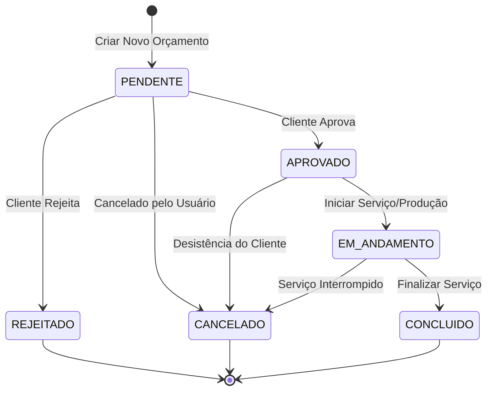

# Diagrama de Estado - Orçamentos

Este diagrama representa o ciclo de vida de um orçamento no sistema e as transições possíveis entre os seus diferentes status.

```mermaid
stateDiagram-v2
    [*] --> PENDENTE : Criar Novo Orçamento

    PENDENTE --> APROVADO : Cliente Aprova
    PENDENTE --> REJEITADO : Cliente Rejeita
    PENDENTE --> CANCELADO : Cancelado pelo Usuário

    APROVADO --> EM_ANDAMENTO : Iniciar Serviço/Produção
    APROVADO --> CANCELADO : Desistência do Cliente

    EM_ANDAMENTO --> CONCLUIDO : Finalizar Serviço
    EM_ANDAMENTO --> CANCELADO : Serviço Interrompido

    REJEITADO --> [*]
    CANCELADO --> [*]
    CONCLUIDO --> [*]
```
